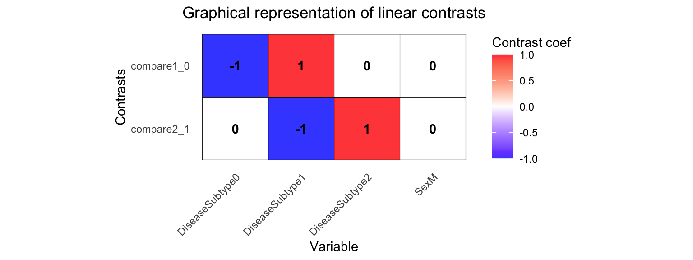
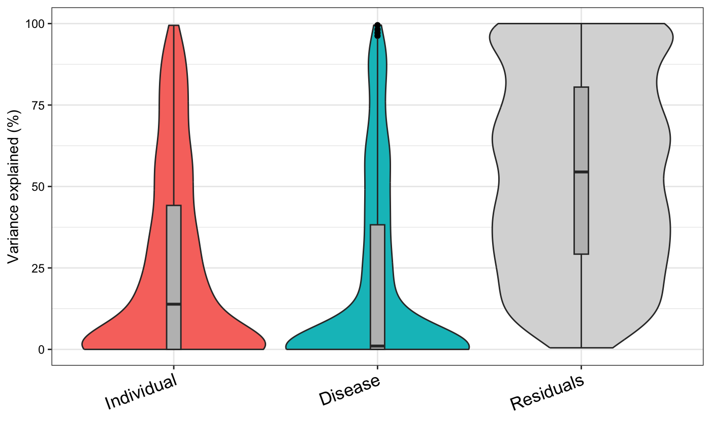
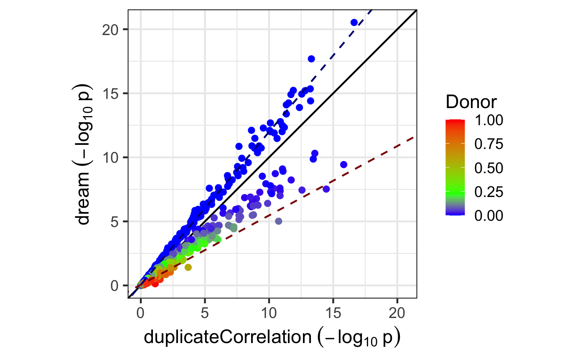

# dream analysis

**D**ifferential expression for **re**pe**a**ted **m**easures (dream)
uses a linear model model to increase power and decrease false positives
for RNA-seq datasets with multiple measurements per individual. The
analysis fits seamlessly into the widely used workflow of limma/voom
(Law et al. 2014). Dream uses a linear model model to increase power and
decrease false positives for RNA-seq datasets with repeated
measurements. Dream achieves this by combining multiple statistical
concepts into a single statistical model. The model includes:

- flexible modeling of repeated measures gene expression data  
- precision weights to model measurement error in RNA-seq counts  
- ability to model multiple random effects  
- random effects estimated separately for each gene  
- hypothesis testing for fixed effects in linear mixed models  
- small sample size hypothesis test  

Dream also includes multi-threaded analysis across thousands of genes on
a multi-core machine.

## Standard RNA-seq processing

This tutorial assumes that the reader is familiar with the limma/voom
workflow for RNA-seq. Process raw count data using limma/voom.

``` r

library("variancePartition")
library("edgeR")
library("BiocParallel")
data(varPartDEdata)

# filter genes by number of counts
isexpr <- rowSums(cpm(countMatrix) > 0.1) >= 5

# Standard usage of limma/voom
dge <- DGEList(countMatrix[isexpr, ])
dge <- calcNormFactors(dge)

# make this vignette faster by analyzing a subset of genes
dge <- dge[1:1000, ]
```

## Limma Analysis

Limma has a built-in approach for analyzing repeated measures data using
[`duplicateCorrelation()`](https://rdrr.io/pkg/limma/man/dupcor.html).
The model can handle a single random effect, and forces the magnitude of
the random effect to be the same across all genes.

``` r

# apply duplicateCorrelation is two rounds
design <- model.matrix(~Disease, metadata)
vobj_tmp <- voom(dge, design, plot = FALSE)
dupcor <- duplicateCorrelation(vobj_tmp, design, block = metadata$Individual)

# run voom considering the duplicateCorrelation results
# in order to compute more accurate precision weights
# Otherwise, use the results from the first voom run
vobj <- voom(dge, design, plot = FALSE, block = metadata$Individual, correlation = dupcor$consensus)

# Estimate linear mixed model with a single variance component
# Fit the model for each gene,
dupcor <- duplicateCorrelation(vobj, design, block = metadata$Individual)

# But this step uses only the genome-wide average for the random effect
fitDupCor <- lmFit(vobj, design, block = metadata$Individual, correlation = dupcor$consensus)

# Fit Empirical Bayes for moderated t-statistics
fitDupCor <- eBayes(fitDupCor)
```

## Dream Analysis

The dream method replaces 4 core functions of limma with a linear mixed
model.

1.  [`voomWithDreamWeights()`](http://DiseaseNeurogenomics.github.io/variancePartition/reference/voomWithDreamWeights.md)
    replaces [`voom()`](https://rdrr.io/pkg/limma/man/voom.html) to
    estimate precision weights
2.  [`dream()`](http://DiseaseNeurogenomics.github.io/variancePartition/reference/dream-method.md)
    replaces [`lmFit()`](https://rdrr.io/pkg/limma/man/lmFit.html) to
    estimate regression coefficients.  
3.  [`variancePartition::eBayes()`](http://DiseaseNeurogenomics.github.io/variancePartition/reference/eBayes.md)
    replaces
    [`limma::eBayes()`](https://rdrr.io/pkg/limma/man/ebayes.html) to
    apply empircal Bayes shrinkage on linear mixed models.
4.  [`variancePartition::topTable()`](http://DiseaseNeurogenomics.github.io/variancePartition/reference/toptable-method.md)
    replaces
    [`limma::topTable()`](https://rdrr.io/pkg/limma/man/toptable.html)
    to give seamless access to results from
    [`dream()`](http://DiseaseNeurogenomics.github.io/variancePartition/reference/dream-method.md).

For models with only fixed effects,
[`variancePartition::eBayes()`](http://DiseaseNeurogenomics.github.io/variancePartition/reference/eBayes.md),
and
[`variancePartition::topTable()`](http://DiseaseNeurogenomics.github.io/variancePartition/reference/toptable-method.md)
work seamlessly and give results equivalent to the `limma` functions
with the same name. From the user perspective, the
[`dream()`](http://DiseaseNeurogenomics.github.io/variancePartition/reference/dream-method.md)
workflow is the same as `limma` since the statistical differences are
handled behind the scenes.

``` r

# Specify parallel processing parameters
# this is used implicitly by dream() to run in parallel
param <- SnowParam(4, "SOCK", progressbar = TRUE)

# The variable to be tested must be a fixed effect
form <- ~ Disease + (1 | Individual)

# estimate weights using linear mixed model of dream
vobjDream <- voomWithDreamWeights(dge, form, metadata, BPPARAM = param)

# Fit the dream model on each gene
# For the hypothesis testing, by default,
# dream() uses the KR method for <= 20 samples,
# otherwise it uses the Satterthwaite approximation
fitmm <- dream(vobjDream, form, metadata)
fitmm <- eBayes(fitmm)
```

``` r

# Examine design matrix
head(fitmm$design, 3)
```

    ##           (Intercept) Disease1
    ## sample_01           1        0
    ## sample_02           1        0
    ## sample_03           1        0

``` r

# Get results of hypothesis test on coefficients of interest
topTable(fitmm, coef = "Disease1", number = 3)
```

    ##                                   logFC  AveExpr        t      P.Value    adj.P.Val        B
    ## ENST00000283033.5 gene=TXNDC11 1.556233 3.567624 32.18311 2.963157e-21 2.963157e-18 38.37597
    ## ENST00000257181.9 gene=PRPF38A 1.380549 4.398270 24.31101 2.046048e-18 1.023024e-15 32.17816
    ## ENST00000525790.1 gene=TDRKH   1.508341 3.184931 19.20262 4.498201e-16 1.261794e-13 26.87813
    ##                                   z.std
    ## ENST00000283033.5 gene=TXNDC11 9.464024
    ## ENST00000257181.9 gene=PRPF38A 8.754723
    ## ENST00000525790.1 gene=TDRKH   8.124335

Since dream uses an estimated degrees of freedom value for each
hypothsis test, the degrees of freedom is different for each gene here.
Therefore, the t-statistics are not directly comparable since they have
different degrees of freedom. In order to be able to compare test
statistics, we report `z.std` which is the p-value transformed into a
signed z-score. This can be used for downstream analysis.

Note that if a random effect is not specified,
[`dream()`](http://DiseaseNeurogenomics.github.io/variancePartition/reference/dream-method.md)
automatically uses
[`lmFit()`](https://rdrr.io/pkg/limma/man/lmFit.html), but the user must
run
[`eBayes()`](http://DiseaseNeurogenomics.github.io/variancePartition/reference/eBayes.md)
afterward.

### Advanced hypothesis testing

#### Using contrasts to compare coefficients

You can also perform a hypothesis test of the *difference* between two
or more coefficients by using a contrast matrix. The contrasts are
evaluated at the time of the model fit and the results can be extracted
with
[`topTable()`](http://DiseaseNeurogenomics.github.io/variancePartition/reference/toptable-method.md).
This behaves like
[`makeContrasts()`](https://rdrr.io/pkg/limma/man/makeContrasts.html)
and
[`contrasts.fit()`](https://rdrr.io/pkg/limma/man/contrasts.fit.html) in
limma.

Multiple contrasts can be evaluated at the same time, in order to save
computation time. Make sure to inspect your contrast matrix to confirm
it is testing what you intend.

``` r

form <- ~ 0 + DiseaseSubtype + Sex + (1 | Individual)

L <- makeContrastsDream(form, metadata,
  contrasts = c(
    compare2_1 = "DiseaseSubtype2 - DiseaseSubtype1",
    compare1_0 = "DiseaseSubtype1 - DiseaseSubtype0"
  )
)

# Visualize contrast matrix
plotContrasts(L)
```



``` r

# fit dream model with contrasts
fit <- dream(vobjDream, form, metadata, L)
fit <- eBayes(fit)

# get names of available coefficients and contrasts for testing
colnames(fit)
```

    ## [1] "compare2_1"      "compare1_0"      "DiseaseSubtype0" "DiseaseSubtype1" "DiseaseSubtype2"
    ## [6] "SexM"

``` r

# extract results from first contrast
topTable(fit, coef = "compare2_1", number = 3)
```

    ##                                       logFC  AveExpr         t      P.Value  adj.P.Val          B
    ## ENST00000355624.3 gene=RAB11FIP2 -0.9493146 5.260280 -5.336063 2.343973e-05 0.02343973  0.8221724
    ## ENST00000593466.1 gene=DDA1      -1.7265710 3.901579 -3.659542 1.378483e-03 0.68924129 -1.5680931
    ## ENST00000200676.3 gene=CETP       1.4777422 3.723438  3.865319 4.126594e-03 0.99948768 -1.8592924
    ##                                      z.std
    ## ENST00000355624.3 gene=RAB11FIP2 -4.229321
    ## ENST00000593466.1 gene=DDA1      -3.199119
    ## ENST00000200676.3 gene=CETP       2.868319

#### Comparing multiple coefficients

So far contrasts have only involved the difference between two
coefficients. But contrasts can also compare any linear combination of
coefficients. Here, consider comparing `DiseaseSubtype0` to the mean of
`DiseaseSubtype1` and `DiseaseSubtype2`. Note you can also customize the
name of the contrast.

``` r

L2 <- makeContrastsDream(form, metadata,
  contrasts =
    c(Test1 = "DiseaseSubtype0 - (DiseaseSubtype1 + DiseaseSubtype2)/2")
)

plotContrasts(L2)
```


``` r

# fit dream model to evaluate contrasts
fit <- dream(vobjDream[1:10, ], form, metadata, L = L2)
fit <- eBayes(fit)

topTable(fit, coef = "Test1", number = 3)
```

    ##                                     logFC  AveExpr         t      P.Value    adj.P.Val        B
    ## ENST00000418210.2 gene=TMEM64  -1.0343236 4.715367 -6.874897 2.770467e-07 2.770467e-06 8.410269
    ## ENST00000456159.1 gene=MET     -0.9830788 2.458926 -6.021668 5.553855e-07 2.776928e-06 5.915610
    ## ENST00000555834.1 gene=RPS6KL1 -0.8954795 5.272063 -5.419044 3.684288e-06 1.228096e-05 4.056947
    ##                                    z.std
    ## ENST00000418210.2 gene=TMEM64  -5.138428
    ## ENST00000456159.1 gene=MET     -5.006119
    ## ENST00000555834.1 gene=RPS6KL1 -4.628441

#### Joint hypothesis test of multiple coefficients

Joint hypothesis testing of multiple coefficients at the same time can
be performed by using an F-test. Just like in limma, the results can be
extracted using
[`topTable()`](http://DiseaseNeurogenomics.github.io/variancePartition/reference/toptable-method.md)

``` r

# extract results from first contrast
topTable(fit, coef = c("DiseaseSubtype2", "DiseaseSubtype1"), number = 3)
```

    ##                                DiseaseSubtype2 DiseaseSubtype1  AveExpr        F      P.Value
    ## ENST00000418210.2 gene=TMEM64         5.301001        5.211674 4.715367 794.2599 2.087246e-24
    ## ENST00000555834.1 gene=RPS6KL1        5.662699        5.719196 5.272063 782.3692 2.541435e-24
    ## ENST00000589123.1 gene=NFIC           6.545195        6.181023 5.855335 659.9594 2.333522e-23
    ##                                   adj.P.Val    F.std
    ## ENST00000418210.2 gene=TMEM64  1.270717e-23 54.52620
    ## ENST00000555834.1 gene=RPS6KL1 1.270717e-23 54.32931
    ## ENST00000589123.1 gene=NFIC    7.778406e-23 52.11208

Since dream uses an estimated degrees of freedom value for each
hypothsis test, the degrees of freedom is different for each gene here.
Therefore, the F-statistics are not directly comparable since they have
different degrees of freedom. In order to be able to compare test
statistics, we report `F.std` which is the p-value transformed into an
F-statistic with df_1 the number of coefficients tested and df_2=\infty.
This can be used for downstream analysis.

### Small-sample method

For small datasets, the Kenward-Roger method can be more powerful. But
it is **substantially** more computationally intensive.

``` r

fitmmKR <- dream(vobjDream, form, metadata, ddf = "Kenward-Roger")
fitmmKR <- eBayes(fitmmKR)
```

### variancePartition plot

Dream and variancePartition share the same underlying linear mixed model
framework. A variancePartition analysis can indicate important variables
that should be included as fixed or random effects in the dream
analysis.

``` r

# Note: this could be run with either vobj from voom()
# or vobjDream from voomWithDreamWeights()
# The resuylts are similar
form <- ~ (1 | Individual) + (1 | Disease)
vp <- fitExtractVarPartModel(vobj, form, metadata)

plotVarPart(sortCols(vp))
```



### Comparing p-values

Here we compare p-values from from
[`dream()`](http://DiseaseNeurogenomics.github.io/variancePartition/reference/dream-method.md)
and `duplicateCorrelation`. In order to understand the empircal
difference between them, we can plot the -\log\_{10} p-values from each
method.

``` r

# Compare p-values and make plot
p1 <- topTable(fitDupCor, coef = "Disease1", number = Inf, sort.by = "none")$P.Value
p2 <- topTable(fitmm, number = Inf, sort.by = "none")$P.Value

plotCompareP(p1, p2, vp$Individual, dupcor$consensus)
```



The duplicateCorrelation method estimates a single variance term
genome-wide even though the donor contribution of a particular gene can
vary substantially from the genome-wide trend. Using a single value
genome-wide for the within-donor variance can reduce power and increase
the false positive rate in a particular, reproducible way. Let \tau^2_g
be the value of the donor component for gene g and \bar{\tau}^2 be the
genome-wide mean. For genes where \tau^2_g\>\bar{\tau}^2, using
\bar{\tau}^2 under-corrects for the donor component so that it increases
the false positive rate compared to using \tau^2_g. Conversely, for
genes where \tau^2_g\<\bar{\tau}^2, using \bar{\tau}^2 over-corrects for
the donor component so that it decreases power. Increasing sample size
does not overcome this issue. The dream method overcomes this issue by
using a \tau^2_g.

Here, the -\log\_{10} p-values from both methods are plotted and colored
by the donor contribution estiamted by variancePartition. The green
value indicates \bar{\tau}^2, while red and blue indicate higher and
lower values, respectively. When only one variance component is used and
the contrast matrix is simple, the effect of using dream versus
duplicateCorrelation is determined by the comparison of \tau^2_g to
\bar{\tau}^2:

dream can increase the -\log\_{10} p-value for genes with a lower donor
component (i.e. \tau^2_g\<\bar{\tau}^2) and decrease -\log\_{10} p-value
for genes with a higher donor component (i.e. \tau^2_g\>\bar{\tau}^2)

Note that using more variance components or a more complicated contrast
matrix can make the relationship more complicated.

## Parallel processing

variancePartition functions including
[`dream()`](http://DiseaseNeurogenomics.github.io/variancePartition/reference/dream-method.md),
[`fitExtractVarPartModel()`](http://DiseaseNeurogenomics.github.io/variancePartition/reference/fitExtractVarPartModel-method.md)
and
[`fitVarPartModel()`](http://DiseaseNeurogenomics.github.io/variancePartition/reference/fitVarPartModel-method.md)
can take advange of multicore machines to speed up analysis. It uses the
[BiocParallel](http://bioconductor.org/packages/BiocParallel/) package
to manage the parallelization.

- Specify parameters with the BPPARAM argument.

``` r

# Request 4 cores, and enable the progress bar
# This is the ideal for Linux, OS X and Windows
param <- SnowParam(4, "SOCK", progressbar = TRUE)
fitmm <- dream(vobjDream, form, metadata, BPPARAM = param)
```

By default `BPPARAM = SerialParam()`.

## Session info

    ## R version 4.5.1 (2025-06-13)
    ## Platform: aarch64-apple-darwin23.6.0
    ## Running under: macOS Sonoma 14.7.1
    ## 
    ## Matrix products: default
    ## BLAS/LAPACK: /opt/homebrew/Cellar/openblas/0.3.30/lib/libopenblasp-r0.3.30.dylib;  LAPACK version 3.12.0
    ## 
    ## locale:
    ## [1] en_US.UTF-8/en_US.UTF-8/en_US.UTF-8/C/en_US.UTF-8/en_US.UTF-8
    ## 
    ## time zone: America/New_York
    ## tzcode source: internal
    ## 
    ## attached base packages:
    ## [1] stats     graphics  grDevices utils     datasets  methods   base     
    ## 
    ## other attached packages:
    ## [1] edgeR_4.6.3              variancePartition_1.39.5 BiocParallel_1.42.2     
    ## [4] limma_3.64.3             ggplot2_4.0.1            pander_0.6.6            
    ## 
    ## loaded via a namespace (and not attached):
    ##  [1] tidyselect_1.2.1    dplyr_1.1.4         farver_2.1.2        S7_0.2.1           
    ##  [5] bitops_1.0-9        fastmap_1.2.0       digest_0.6.39       lifecycle_1.0.4    
    ##  [9] statmod_1.5.1       magrittr_2.0.4      compiler_4.5.1      rlang_1.1.6        
    ## [13] sass_0.4.10         tools_4.5.1         yaml_2.3.10         knitr_1.50         
    ## [17] labeling_0.4.3      htmlwidgets_1.6.4   plyr_1.8.9          RColorBrewer_1.1-3 
    ## [21] KernSmooth_2.23-26  withr_3.0.2         purrr_1.2.0         numDeriv_2016.8-1.1
    ## [25] BiocGenerics_0.54.1 desc_1.4.3          grid_4.5.1          aod_1.3.3          
    ## [29] caTools_1.18.3      scales_1.4.0        gtools_3.9.5        iterators_1.0.14   
    ## [33] MASS_7.3-65         dichromat_2.0-0.1   cli_3.6.5           mvtnorm_1.3-3      
    ## [37] rmarkdown_2.30      ragg_1.5.0          reformulas_0.4.2    generics_0.1.4     
    ## [41] reshape2_1.4.5      minqa_1.2.8         cachem_1.1.0        stringr_1.6.0      
    ## [45] splines_4.5.1       parallel_4.5.1      matrixStats_1.5.0   vctrs_0.6.5        
    ## [49] boot_1.3-32         Matrix_1.7-4        jsonlite_2.0.0      pbkrtest_0.5.5     
    ## [53] systemfonts_1.3.1   locfit_1.5-9.12     jquerylib_0.1.4     tidyr_1.3.1        
    ## [57] snow_0.4-4          glue_1.8.0          pkgdown_2.2.0       nloptr_2.2.1       
    ## [61] codetools_0.2-20    stringi_1.8.7       gtable_0.3.6        EnvStats_3.1.0     
    ## [65] lme4_1.1-38         lmerTest_3.1-3      tibble_3.3.0        remaCor_0.0.20     
    ## [69] pillar_1.11.1       htmltools_0.5.8.1   gplots_3.2.0        R6_2.6.1           
    ## [73] textshaping_1.0.4   Rdpack_2.6.4        evaluate_1.0.5      lattice_0.22-7     
    ## [77] Biobase_2.68.0      rbibutils_2.4       backports_1.5.0     RhpcBLASctl_0.23-42
    ## [81] broom_1.0.10        fANCOVA_0.6-1       corpcor_1.6.10      bslib_0.9.0        
    ## [85] Rcpp_1.1.0          nlme_3.1-168        xfun_0.54           fs_1.6.6           
    ## [89] pkgconfig_2.0.3

\<\>

## References

Law, C. W., Y. Chen, W. Shi, and G. K. Smyth. 2014. “Voom: precision
weights unlock linear model analysis tools for RNA-seq read counts.”
*Genome Biology* 15 (2): R29.
<https://doi.org/10.1186/gb-2014-15-2-r29>.
