# Variance partitioning analysis

## Introduction

Gene expression datasets are complicated and have multiple sources of
biological and technical variation. These datasets have recently become
more complex as it is now feasible to assay gene expression from the
same individual in multiple tissues or at multiple time points. The
`variancePartition` package implements a statistical method to quantify
the contribution of multiple sources of variation and decouple
within/between-individual variation. In addition, `variancePartition`
produces results at the gene-level to identity genes that follow or
deviate from the genome-wide trend.

The `variancePartition` package provides a general framework for
understanding drivers of variation in gene expression in experiments
with complex designs. A typical application would consider a dataset of
gene expression from individuals sampled in multiple tissues or multiple
time points where the goal is to understand variation within versus
between individuals and tissues. `variancePartition` use a linear mixed
model to partition the variance attributable to multiple variables in
the data. The analysis is built on top of the `lme4` package (Bates et
al. 2015), and some basic knowledge about linear mixed models will give
you some intuition about the behavior of `variancePartition` (Pinheiro
and Bates 2000; Galecki and Burzykowski 2013).

### Input data

There are three components to an analysis:

1.  **Gene expression data:** In general, this is a matrix of normalized
    gene expression values with genes as rows and experiments as
    columns.

- Count-based quantification: `featureCounts` (Liao et al. 2014),
  `HTSeq` (Anders et al. 2015)

  Counts mapping to each gene can be normalized using counts per million
  (CPM), reads per kilobase per million (RPKM) or fragments per kilobase
  per million (FPKM). These count results can be processed with
  [`limma::voom()`](https://rdrr.io/pkg/limma/man/voom.html) (Law et
  al. 2014) to model the precision of each observation or `DESeq2` (Love
  et al. 2014).

- Isoform quantification: `kallisto` (Bray et al. 2016), `sailfish`
  (Patro et al. 2014), `salmon` (Patro et al. 2015), `RSEM` (Li and
  Dewey 2011), `cufflinks` (Trapnell et al. 2010)

  These perform isoform-level quantification using reads that map to
  multiple transcripts. Quantification values can be read directly into
  R, or processed with `ballgown` (Frazee et al. 2015) or `tximport`
  (Soneson et al. 2015).

- Microarray data: any standard normalization such as `rma` in the
  `oligo` (Carvalho and Irizarry 2010) package can be used.

- Any set of features: chromatin accessibility, protein quantification,
  etc

2.  **Metadata about each experiment:**

    A `data.frame` with information about each experiment such as
    patient ID, tissue, sex, disease state, time point, batch, etc.

3.  **Formula indicating which metadata variables to consider:**

    An R formula such as
    `~ Age + (1|Individual) + (1|Tissue) + (1|Batch)` indicating which
    metadata variables should be used in the analysis.

Variance partitioning analysis will assess the contribution of each
metadata variable to variation in gene expression and can report the
intra-class correlation for each variable.

## Running an analysis

A typical analysis with `variancePartition` is only a few lines of R
code, assuming the expression data has already been normalized.
Normalization is a separate topic addressed briefly in \[Applying
`variancePartition` to RNA-seq expression data\].

The simulated dataset included as an example contains measurements of
200 genes from 100 samples. These samples include assays from 3 tissues
across 25 individuals processed in 4 batches. The individuals range in
age from 36 to 73. A typical `variancePartition` analysis will assess
the contribution of each aspect of the study design (i.e. individual,
tissue, batch, age) to the expression variation of each gene. The
analysis will prioritize these axes of variation based on a genome-wide
summary and give results at the gene-level to identity genes that follow
or deviate from this genome-wide trend. The results can be visualized
using custom plots and can be used for downstream analysis.

### Standard application

``` r

# load library
library("variancePartition")

# load simulated data:
# geneExpr: matrix of gene expression values
# info: information/metadata about each sample
data(varPartData)

# Specify variables to consider
# Age is continuous so model it as a fixed effect
# Individual and Tissue are both categorical,
# so model them as random effects
# Note the syntax used to specify random effects
form <- ~ Age + (1 | Individual) + (1 | Tissue) + (1 | Batch)

# Fit model and extract results
# 1) fit linear mixed model on gene expression
# If categorical variables are specified,
#     a linear mixed model is used
# If all variables are modeled as fixed effects,
#       a linear model is used
# each entry in results is a regression model fit on a single gene
# 2) extract variance fractions from each model fit
# for each gene, returns fraction of variation attributable
#       to each variable
# Interpretation: the variance explained by each variables
# after correcting for all other variables
# Note that geneExpr can either be a matrix,
# and EList output by voom() in the limma package,
# or an ExpressionSet
varPart <- fitExtractVarPartModel(geneExpr, form, info)

# sort variables (i.e. columns) by median fraction
#       of variance explained
vp <- sortCols(varPart)

# Figure 1a
# Bar plot of variance fractions for the first 10 genes
plotPercentBars(vp[1:10, ])
```

    ## Warning in geom_bar(stat = "identity", width = width): Ignoring empty aesthetic: `width`.

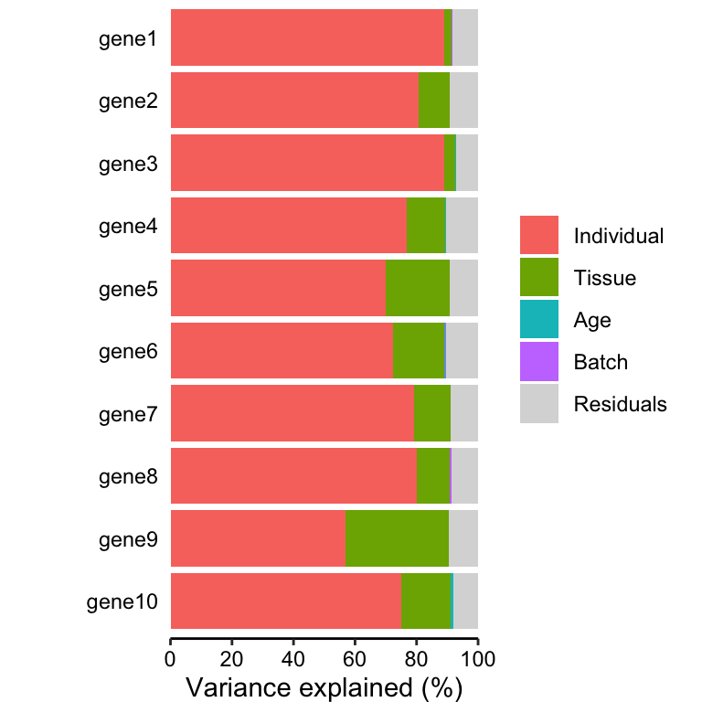

``` r

# Figure 1b
# violin plot of contribution of each variable to total variance
plotVarPart(vp)
```

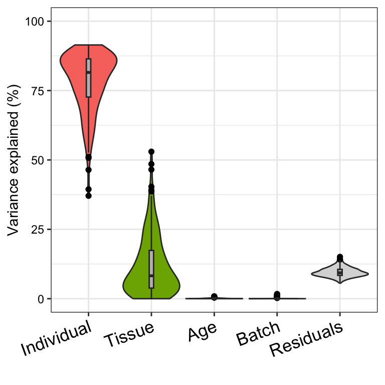

`variancePartition` includes a number of custom plots to visualize the
results. Since `variancePartition` attributes the fraction of total
variation attributable to each aspect of the study design, these
fractions naturally sum to 1. plots the partitioning results for a
subset of genes (Figure 1a), and shows a genome-wide violin plot of the
distribution of variance explained by each variable across all genes
(Figure 1b). (Note that these plots show results in terms of of variance
explained, while the results are stored in terms of the *fraction*.)

The core functions of `variancePartition` work seemlessly with gene
expression data stored as a `matrix`, `data.frame`, `EList` from `limma`
or `ExpressionSet` from `Biobase`.
[`fitExtractVarPartModel()`](http://DiseaseNeurogenomics.github.io/variancePartition/reference/fitExtractVarPartModel-method.md)
returns an object that stores the variance fractions for each gene and
each variable in the formula specified. These fractions can be accessed
just like a `data.frame`:

``` r

# Access first entries
head(varPart)
```

    ##             Batch Individual     Tissue          Age  Residuals
    ## gene1 0.000157942  0.8903734 0.02468870 4.528911e-05 0.08473466
    ## gene2 0.000000000  0.8060315 0.10101913 3.336681e-04 0.09261569
    ## gene3 0.002422410  0.8901149 0.03561726 1.471692e-03 0.07037370
    ## gene4 0.000000000  0.7688280 0.12531345 1.014413e-03 0.10484417
    ## gene5 0.000000000  0.6997242 0.20910145 3.871487e-05 0.09113564
    ## gene6 0.002343666  0.7222283 0.16786542 2.717378e-03 0.10484521

``` r

# Access first entries for Individual
head(varPart$Individual)
```

    ## [1] 0.8903734 0.8060315 0.8901149 0.7688280 0.6997242 0.7222283

``` r

# sort genes based on variance explained by Individual
head(varPart[order(varPart$Individual, decreasing = TRUE), ])
```

    ##               Batch Individual      Tissue          Age  Residuals
    ## gene43  0.000000000  0.9143523 0.011737173 3.776742e-04 0.07353288
    ## gene174 0.000000000  0.9112702 0.009726000 2.015102e-03 0.07698866
    ## gene111 0.000000000  0.9067082 0.008386574 9.735963e-04 0.08393164
    ## gene127 0.000000000  0.9035627 0.013838829 5.081821e-04 0.08209027
    ## gene151 0.006079206  0.9029393 0.000000000 1.345019e-05 0.09096803
    ## gene91  0.000000000  0.9002946 0.014144935 1.110517e-06 0.08555939

##### Saving plot to file

In order to save the plot to a file, use the
[`ggsave()`](https://ggplot2.tidyverse.org/reference/ggsave.html)
function:

``` r

fig <- plotVarPart(vp)
ggsave(file, fig)
```

#### Plot expression stratified by other variables

`variancePartition` also includes plotting functions to visualize the
variation across a variable of interest. plots the expression of a gene
stratified by the specified variable. In the example dataset, users can
plot a gene expression trait stratified by Tissue (Figure 2a) or
Individual (Figure 2b).

``` r

# get gene with the highest variation across Tissues
# create data.frame with expression of gene i and Tissue
#       type for each sample
i <- which.max(varPart$Tissue)
GE <- data.frame(Expression = geneExpr[i, ], Tissue = info$Tissue)

# Figure 2a
# plot expression stratified by Tissue
plotStratify(Expression ~ Tissue, GE, main = rownames(geneExpr)[i])
```

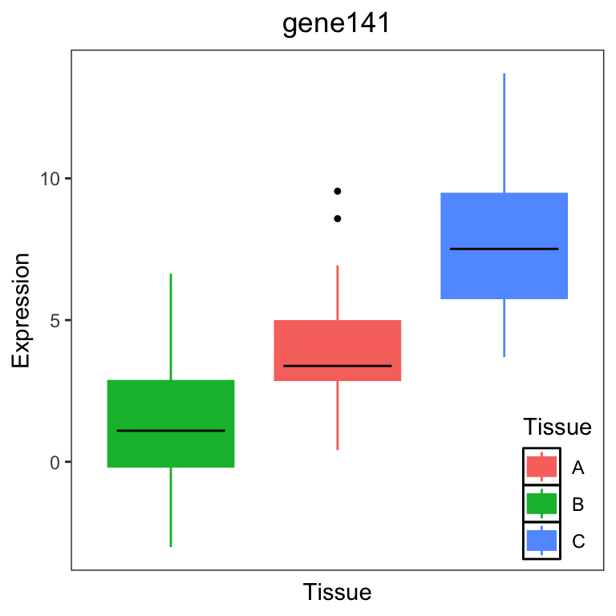

``` r

# get gene with the highest variation across Individuals
# create data.frame with expression of gene i and Tissue
#       type for each sample
i <- which.max(varPart$Individual)
GE <- data.frame(
  Expression = geneExpr[i, ],
  Individual = info$Individual
)

# Figure 2b
# plot expression stratified by Tissue
label <- paste("Individual:", format(varPart$Individual[i] * 100,
  digits = 3
), "%")
main <- rownames(geneExpr)[i]
plotStratify(Expression ~ Individual, GE,
  colorBy = NULL,
  text = label, main = main
)
```

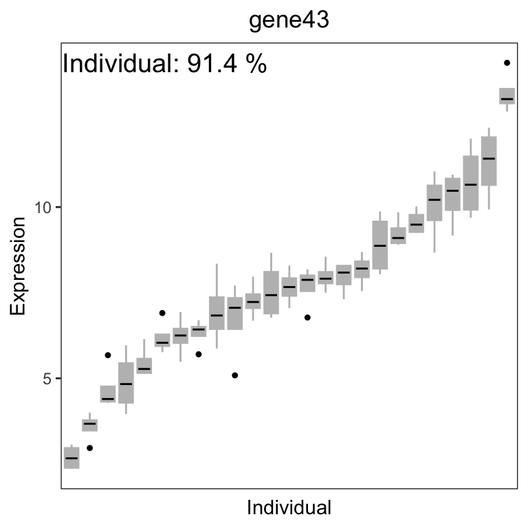

For gene141, variation across tissues explains 52.9% of variance in gene
expression. For gene43, variation across Individuals explains 91.4% of
variance in gene expression.

#### Intuition about the backend

At the heart of `variancePartition`, a regression model is fit for each
gene separately and summary statistics are extracted and reported to the
user for visualization and downstream analysis. For a single model fit,
[`calcVarPart()`](http://DiseaseNeurogenomics.github.io/variancePartition/reference/calcVarPart-method.md)
computes the fraction of variance explained by each variable.
[`calcVarPart()`](http://DiseaseNeurogenomics.github.io/variancePartition/reference/calcVarPart-method.md)
is defined by this package, and computes these statistics from either a
fixed effects model fit with [`lm()`](https://rdrr.io/r/stats/lm.html)
or a linear mixed model fit with
[`lme4::lmer()`](https://rdrr.io/pkg/lme4/man/lmer.html).
[`fitExtractVarPartModel()`](http://DiseaseNeurogenomics.github.io/variancePartition/reference/fitExtractVarPartModel-method.md)
loops over each gene, fits the regression model and returns the variance
fractions reported by
[`calcVarPart()`](http://DiseaseNeurogenomics.github.io/variancePartition/reference/calcVarPart-method.md).

Fitting the regression model and extracting variance statistics can also
be done directly:

``` r

library("lme4")

# fit regression model for the first gene
form_test <- geneExpr[1, ] ~ Age + (1 | Individual) + (1 | Tissue)
fit <- lmer(form_test, info, REML = FALSE)

# extract variance statistics
calcVarPart(fit)
```

    ##   Individual       Tissue          Age    Residuals 
    ## 8.903140e-01 2.468013e-02 4.354738e-05 8.496235e-02

### Interpretation

`variancePartition` fits a linear (mixed) model that jointly considers
the contribution of all specified variables on the expression of each
gene. It uses a multiple regression model so that the effect of each
variable is assessed while jointly accounting for all others. [Standard
ANOVA](https://www.r-bloggers.com/2011/03/anova-%E2%80%93-type-iiiiii-ss-explained/)
implemented in R involves refitting the model while dropping terms, but
is aimed at hypothesis testing.
[`calcVarPart()`](http://DiseaseNeurogenomics.github.io/variancePartition/reference/calcVarPart-method.md)
is aimed at estimating variance fractions. It uses a single fit of the
linear (mixed) model and evaluates the sum of squares of each term and
the sum of squares of the total model fit. However, we note that like
any multiple regression model, high correlation bewtween fixed or random
effect variables (see [Assess correlation between all pairs of
variables](#assess-correlation-between-all-pairs-of-variables)) can
produce unstable estimates and it can be challanging to identify which
variable is responsible for the expression variation.

The results of `variancePartition` give insight into the expression data
at multiple levels. Moreover, a single statistic often has multiple
equivalent interpretations while only one is relevant to the biological
question. Analysis of the example data in Figure 1 gives some strong
interpretations.

Considering the median across all genes,

1.  variation across individuals explains a median of 81.5% of the
    variation in expression, after correcting for tissue, batch and age
2.  variation across tissues explains a median of 8.2% of the variation
    in expression, after correcting for other the variables
3.  variation across batches is negligible after correcting for
    variation due to other variables
4.  the effect of age is negligible after correcting for other variables
5.  correcting for individual, tissue, batch and age leaves a median of
    9.3% of the total variance in expression.

These statistics also have a natural interpretation in terms of the
intra-class correlation (ICC), the correlation between observations made
from samples in the same group.

Considering the median across across all genes and all experiments,

1.  the ICC for *individual* is 81.5%.
2.  the ICC for *tissue* is 8.2%.
3.  two randomly selected gene measurements from same *individual*, but
    regardless of *tissue*, *batch* or *age*, have a correlation of
    81.5%.
4.  two randomly selected gene measurements from same *tissue*, but
    regardless of *individual*, *batch* or *age*, have a correlation of
    8.2%.
5.  two randomly selected gene measurements from the same *individual*
    *and* same *tissue*, but regardless of *batch* and *age*, have an
    correlation of 81.5% + 8.2% = 89.7%.

Note that that the ICC here is interpreted as the ICC after correcting
for all other variables in the model.

These conclusions are based on the genome-wide median across all genes,
but the same type of statements can be made at the gene-level. Moreover,
care must be taken in the interpretation of nested variables. For
example, `Age` is nested within `Individual` since the multiple samples
from each individual are taken at the same age. Thus the effect of `Age`
removes some variation from being explained by `Individual`. This often
arises when considering variation across individuals and across sexes:
any cross-sex variation is a component of the cross-individual
variation. So the total variation across individuals is the sum of the
fraction of variance explained by `Sex` and `Individual`. This
nesting/summing of effects is common for variables that are properties
of the individual rather than the sample. For example, sex and ethnicity
are always properties of the individual. Variables like age and disease
state can be properties of the individual, but could also vary in
time-course or longitudinal experiments. The the interpretation depends
on the experimental design.

The real power of `variancePartition` is to identify specific genes that
follow or deviate from the genome-wide trend. The gene-level statistics
can be used to identify a subset of genes that are enriched for specific
biological functions. For example, we can ask if the 500 genes with the
highest variation in expression across tissues (i.e. the long tail for
tissue in Figure 1a) are enriched for genes known to have high
tissue-specificity.

#### Should a variable be modeled as fixed or random effect?

Categorical variables should (almost) always be modeled as a random
effect. The difference between modeling a categorical variable as a
fixed versus random effect is minimal when the sample size is large
compared to the number of categories (i.e. levels). So variables like
disease status, sex or time point will not be sensitive to modeling as a
fixed versus random effect. However, variables with many categories like
`Individual` *must* be modeled as a random effect in order to obtain
statistically valid results. So to be on the safe side, categorical
variable should be modeled as a random effect.

% R and `variancePartition` handle catagorical variables stored as a
very naturally. If categorical variables are stored as an or , they must
be converted to a before being used with `variancePartition`

`variancePartition` fits two types of models:

1.  linear mixed model where *all* categorical variables are modeled as
    random effects and all continuous variables are fixed effects. The
    function [`lme4::lmer()`](https://rdrr.io/pkg/lme4/man/lmer.html) is
    used to fit this model.

2.  fixed effected model, where all variables are modeled as fixed
    effects. The function [`lm()`](https://rdrr.io/r/stats/lm.html) is
    used to fit this model.

#### Which variables should be included?

In my experience, it is useful to include all variables in the first
analysis and then drop variables that have minimal effect. However, like
all multiple regression methods, `variancePartition` will divide the
contribution over multiple variables that are strongly correlated. So,
for example, including both sex and height in the model will show sex
having a smaller contribution to variation gene expression than if
height were omitted, since there variables are strongly correlated. This
is a simple example, but should give some intuition about a common issue
that arises in analyses with `variancePartition`.

`variancePartition` can naturally assess the contribution of both
individual and sex in a dataset. As expected, genes for which sex
explains a large fraction of variation are located on chrX and chrY. If
the goal is to interpret the impact of sex, then there is no issue. But
recall the issue with correlated variables and note that individual is
correlated with sex, because each individual is only one sex regardless
of how many samples are taken from a individual. It follows that
including sex in the model reduces the *apparent* contribution of
individual to gene expression. In other words, the ICC for individual
will be different if sex is included in the model.

In general, including variables in the model that do not vary within
individual will reduce the apparent contribution of individual as
estimated by `variancePartition`. For example, sex and ethnicity never
vary between multiple samples from the same individual and will always
reduce the apparent contribution of individual. However, disease state
and age may or may not vary depending on the study design.

In biological datasets technical variability (i.e. batch effects) can
often reduce the apparent biological signal. In RNA-seq analysis, it is
common for the the impact of this technical variability to be removed
before downstream analysis. Instead of including these batch variable in
the `variancePartition` analysis, it is simple to complete the
expression residuals with the batch effects removed and then feeds these
residuals to `variancePartition`. This will increase the fraction of
variation explained by biological variables since technical variability
is reduced.

##### Assess correlation between all pairs of variables

Evaluating the correlation between variables in a important part in
interpreting variancePartition results. When comparing two continuous
variables, Pearson correlation is widely used. But variancePartition
includes categorical variables in the model as well. In order to
accommodate the correlation between a continuous and a categorical
variable, or two categorical variables we used canonical correlation
analysis.

Canonical Correlation Analysis (CCA) is similar to correlation between
two vectors, except that CCA can accommodate matricies as well. For a
pair of variables,
[`canCorPairs()`](http://DiseaseNeurogenomics.github.io/variancePartition/reference/canCorPairs.md)
assesses the degree to which they co-vary and contain the same
information. Variables in the formula can be a continuous variable or a
discrete variable expanded to a matrix (which is done in the backend of
a regression model). For a pair of variables,
[`canCorPairs()`](http://DiseaseNeurogenomics.github.io/variancePartition/reference/canCorPairs.md)
uses CCA to compute the correlation between these variables and returns
the pairwise correlation matrix.

Statistically, let `rho` be the array of correlation values returned by
the standard R function cancor to compute CCA.
[`canCorPairs()`](http://DiseaseNeurogenomics.github.io/variancePartition/reference/canCorPairs.md)
returns `rho / sum(rho)` which is the fraction of the maximum possible
correlation. Note that CCA returns correlations values between 0 and 1

``` r

form <- ~ Individual + Tissue + Batch + Age + Height

# Compute Canonical Correlation Analysis (CCA)
# between all pairs of variables
# returns absolute correlation value
C <- canCorPairs(form, info)
```

    ## Warning: the 'subbars' function has moved to the reformulas package. Please update your imports, or ask an upstream package maintainter to do so.
    ## This warning is displayed once per session.

``` r

# Plot correlation matrix
# between all pairs of variables
plotCorrMatrix(C)
```

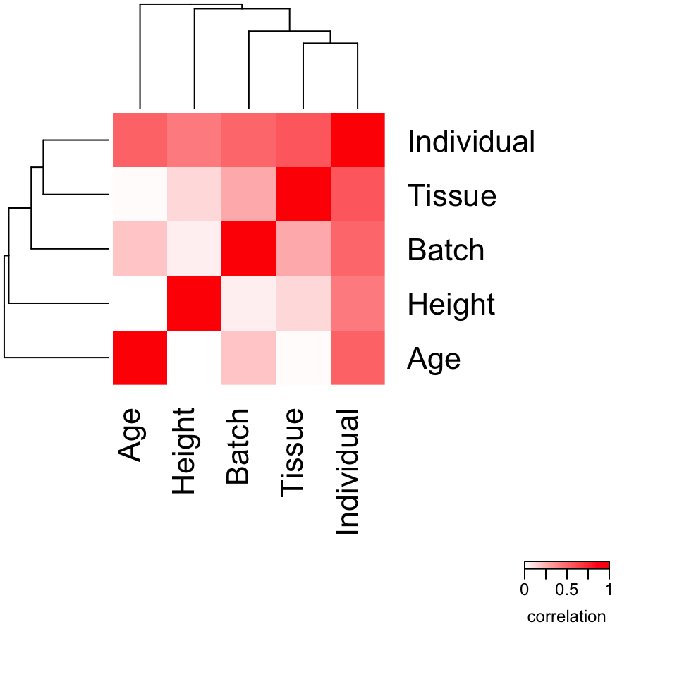

### Advanced analysis

#### Extracting additional information from model fits

Advanced users may want to perform the model fit and extract results in
separate steps in order to examine the fit of the model for each gene.
Thus the work of can be divided into two steps: 1) fit the regression
model, and 2) extracting variance statistics.

``` r

form <- ~ Age + (1 | Individual) + (1 | Tissue) + (1 | Batch)

# Fit model
results <- fitVarPartModel(geneExpr, form, info)

# Extract results
varPart <- extractVarPart(results)
```

Note that storing the model fits can use a lot of memory (~10Gb with 20K
genes and 1000 experiments). I do not recommend unless you have a
specific need for storing the entire model fit.

Instead,
[`fitVarPartModel()`](http://DiseaseNeurogenomics.github.io/variancePartition/reference/fitVarPartModel-method.md)
can extract any desired information using any function that accepts the
model fit from [`lm()`](https://rdrr.io/r/stats/lm.html) or
[`lmer()`](https://rdrr.io/pkg/lme4/man/lmer.html). The results are
stored in a `list` and can be used for downstream analysis.

``` r

# Fit model and run summary() function on each model fit
vpSummaries <- fitVarPartModel(geneExpr, form, info, fxn = summary)
```

``` r

# Show results of summary() for the first gene
vpSummaries[[1]]
```

    ## Linear mixed model fit by maximum likelihood  ['lmerMod']
    ## Formula: y.local ~ Age + (1 | Individual) + (1 | Tissue) + (1 | Batch)
    ##    Data: data
    ## Weights: data$w.local
    ## Control: control
    ## 
    ##       AIC       BIC    logLik -2*log(L)  df.resid 
    ##     397.2     412.8    -192.6     385.2        94 
    ## 
    ## Scaled residuals: 
    ##      Min       1Q   Median       3Q      Max 
    ## -2.05797 -0.58651  0.01466  0.66030  1.97077 
    ## 
    ## Random effects:
    ##  Groups     Name        Variance Std.Dev.
    ##  Individual (Intercept) 10.82274 3.28979 
    ##  Batch      (Intercept)  0.00192 0.04382 
    ##  Tissue     (Intercept)  0.30010 0.54781 
    ##  Residual                1.02997 1.01488 
    ## Number of obs: 100, groups:  Individual, 25; Batch, 4; Tissue, 3
    ## 
    ## Fixed effects:
    ##               Estimate Std. Error t value
    ## (Intercept) -10.602426   1.094925  -9.683
    ## Age           0.003183   0.016103   0.198
    ## 
    ## Correlation of Fixed Effects:
    ##     (Intr)
    ## Age -0.739

#### Removing batch effects before fitting model

Gene expression studies often have substantial batch effects, and
`variancePartition` can be used to understand the magnitude of the
effects. However, we often want to focus on biological variables
(i.e. individual, tissue, disease, sex) after removing the effect of
technical variables. Depending on the size of the batch effect, I have
found it useful to correct for the batch effect first and then perform a
`variancePartition` analysis afterward. Subtracting this batch effect
can reduce the total variation in the data, so that the contribution of
other variables become clearer.

Standard analysis:

``` r

form <- ~ (1 | Tissue) + (1 | Individual) + (1 | Batch) + Age
varPart <- fitExtractVarPartModel(geneExpr, form, info)
```

Analysis on residuals:

``` r

library("limma")
# subtract out effect of Batch
fit <- lmFit(geneExpr, model.matrix(~Batch, info))
res <- residuals(fit, geneExpr)

# fit model on residuals
form <- ~ (1 | Tissue) + (1 | Individual) + Age

varPartResid <- fitExtractVarPartModel(res, form, info)
```

Remove batch effect with linear mixed model

``` r

# subtract out effect of Batch with linear mixed model
modelFit <- fitVarPartModel(geneExpr, ~ (1 | Batch), info)
res <- residuals(modelFit)

# fit model on residuals
form <- ~ (1 | Tissue) + (1 | Individual) + Age

varPartResid <- fitExtractVarPartModel(res, form, info)
```

If the two-step process requires too much memory, the residuals can be
computed more efficiently. Here, run the function inside the call to
[`fitVarPartModel()`](http://DiseaseNeurogenomics.github.io/variancePartition/reference/fitVarPartModel-method.md)
to avoid storing the large intermediate results.

``` r

# extract residuals directly without storing intermediate results
residList <- fitVarPartModel(geneExpr, ~ (1 | Batch), info,
  fxn = residuals
)

# convert list to matrix
residMatrix <- do.call(rbind, residList)
```

#### Variation within multiple subsets of the data

So far, we have focused on interpreting one variable at a time. But the
linear mixed model behind `variancePartition` is a very powerful
framework for analyzing variation at multiple levels. We can easily
extend the previous analysis of the contribution of individual and
tissue on variation in gene expression to examine the contribution of
individual *within* each tissue. This analysis is as easy as specifying
a new formula and rerunning `variancePartition`. Note that is analysis
will only work when there are replicates for at least some individuals
within each tissue in order to assess cross-individual variance with in
a tissue.

``` r

# specify formula to model within/between individual variance
# separately for each tissue
# Note that including +0 ensures each tissue is modeled explicitly
# Otherwise, the first tissue would be used as baseline
form <- ~ (Tissue + 0 | Individual) + Age + (1 | Tissue) + (1 | Batch)

# fit model and extract variance percents
varPart <- fitExtractVarPartModel(geneExpr, form, info, showWarnings = FALSE)

# violin plot
plotVarPart(sortCols(varPart), label.angle = 60)
```

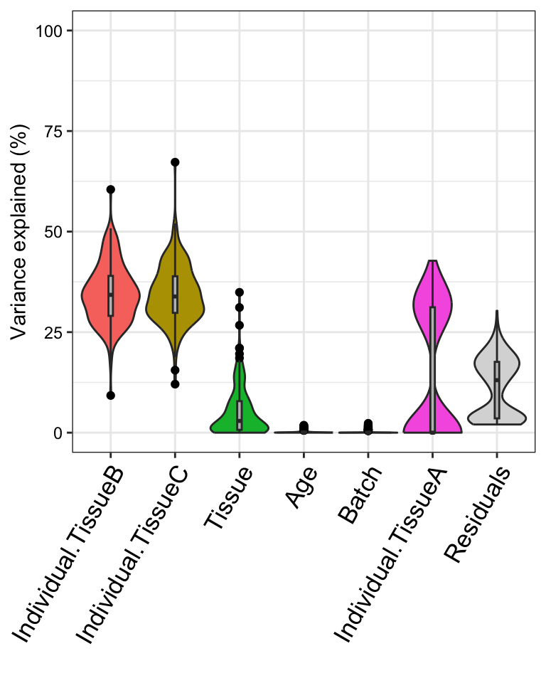

This analysis corresponds to a varying coefficient model, where the
correlation between individuals varies for each tissue \]. Since the
variation across individuals is modeled within each tissue, the total
variation explained does not sum to 1 as it does for standard
application of `variancePartition`. So interpretation as intra-class
does not strictly apply and use of
[`plotPercentBars()`](http://DiseaseNeurogenomics.github.io/variancePartition/reference/plotPercentBars-method.md)
is no longer applicable. Yet the variables in the study design are still
ranked in terms of their genome-wide contribution to expression
variation, and results can still be analyzed at the gene level. See
[Variation with multiple subsets of the
data](#variation-with-multiple-subsets-of-the-data) for statistical
details.

#### Detecting problems caused by collinearity of variables

Including variables that are highly correlated can produce misleading
results and overestimate the contribution of variables modeled as fixed
effects. This is usually not an issue, but can arise when statistically
redundant variables are included in the model. In this case, the model
is `"degenerate"` or `"computationally singular"` and parameter
estimates from this model are not meaningful. Dropping one or more of
the covariates will fix this problem.

A check of collinearity is built into
[`fitVarPartModel()`](http://DiseaseNeurogenomics.github.io/variancePartition/reference/fitVarPartModel-method.md)
and
[`fitExtractVarPartModel()`](http://DiseaseNeurogenomics.github.io/variancePartition/reference/fitExtractVarPartModel-method.md),
so the user will be warned if this is an issue.

Alternatively, the user can use the
[`colinearityScore()`](http://DiseaseNeurogenomics.github.io/variancePartition/reference/colinearityScore.md)
function to evaluate whether this is an issue for a single model fit:

``` r

form <- ~ (1 | Individual) + (1 | Tissue) + Age + Height

# fit model
res <- fitVarPartModel(geneExpr[1:4, ], form, info)
```

``` r

# evaluate the collinearity score on the first model fit
# this reports the correlation matrix between coefficient estimates
# for fixed effects
# the collinearity score is the maximum absolute correlation value
# If the collinearity score > .99 then the variance partition
# estimates may be problematic
# In that case, a least one variable should be omitted
colinearityScore(res[[1]])
```

    ## [1] 0.7774082
    ## attr(,"vcor")
    ##             (Intercept)         Age      Height
    ## (Intercept)   1.0000000 -0.41907978 -0.77740819
    ## Age          -0.4190798  1.00000000 -0.05748224
    ## Height       -0.7774082 -0.05748224  1.00000000

#### Including weights computed separately

`variancePartition` automatically used precision weights computed by
[`limma::voom()`](https://rdrr.io/pkg/limma/man/voom.html), but the user
can also specify custom weights using the `weightsMatrix` argument.

``` r

form <- ~ (1 | Individual) + (1 | Tissue) + Age + Height

# Specify custom weights
# In this example the weights are simulated from a
# uniform distribution and are not meaningful.
weights <- matrix(runif(length(geneExpr)), nrow = nrow(geneExpr))

# Specify custom weights
res <- fitExtractVarPartModel(geneExpr[1:4, ], form, info,
  weightsMatrix = weights[1:4, ]
)
```

In addition, setting the `useWeights=FALSE` will suppress usage of the
weights in all cases, i.e. when the weights are specified manually or
implicitly with the results of
[`limma::voom()`](https://rdrr.io/pkg/limma/man/voom.html).

#### Including interaction terms

Typical analysis assumes that the effect of each variable on gene
expression does not depend on other variables in the model. Sometimes
this assumption is too strict, and we want to model an interaction
effect whereby the effect of `Batch` depends on `Tissue`. This can be
done easly by specifying an interaction term, `(1|Batch:Tissue)`. Since
`Batch` has 4 categories and `Tissue` has 3, this interaction term
implicity models a new `3*4 = 12` category variable in the analysis.
This new interaction term will absorb some of the variance from the
`Batch` and `Tissue` term, so an interaction model should always include
the two constituent variables.

Here we fit an interaction model, but we observe that interaction
between `Batch` and `Tissue` does not explain much expression variation.

``` r

form <- ~ (1 | Individual) + Age + Height + (1 | Tissue) + (1 | Batch) +
  (1 | Batch:Tissue)

# fit model
vpInteraction <- fitExtractVarPartModel(geneExpr, form, info)

plotVarPart(sortCols(vpInteraction))
```

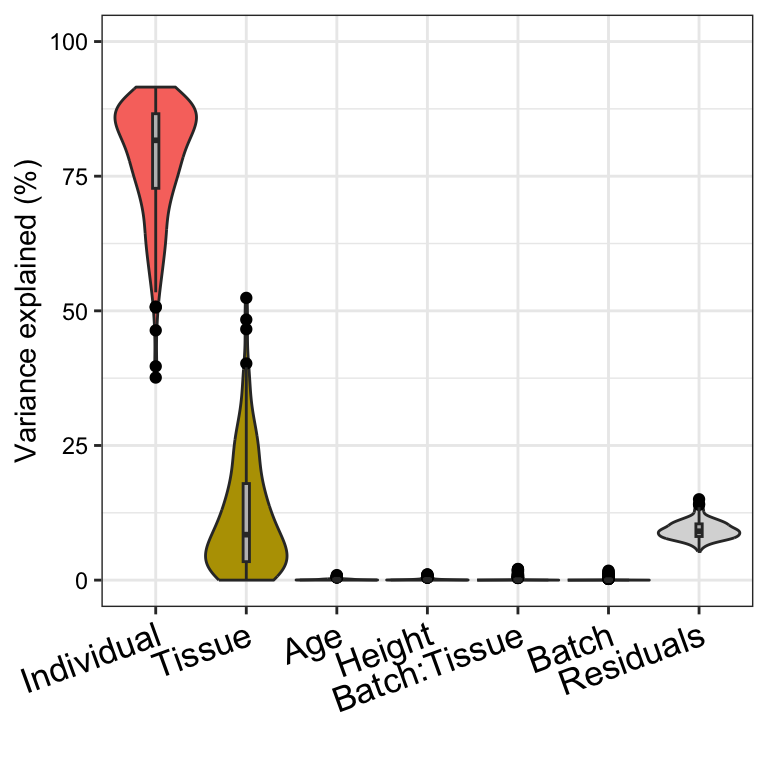

## Application to expression data

`variancePartition` works with gene expression data that has already
been processed and normalized as for differential expression analysis.

### Gene-level counts

`featureCounts` (Liao et al. 2014) and `HTSeq` (Anders et al. 2015)
report the number of reads mapping to each gene (or exon). These results
are easily read into R.
[`limma::voom()`](https://rdrr.io/pkg/limma/man/voom.html) and `DESeq2`
are widely used for differential expression analysis of gene- and
exon-level counts and can be used to process data before analysis with
`variancePartition`. This section addresses processing and normalization
of gene-level counts, but the analysis is the same for exon-level
counts.

#### `limma::voom()`

Read RNA-seq counts into R, normalize for library size within and
between experiments with TMM (Robinson and Oshlack 2010), estimate
precision weights with
[`limma::voom()`](https://rdrr.io/pkg/limma/man/voom.html).

``` r

library("limma")
library("edgeR")

# identify genes that pass expression cutoff
isexpr <- rowSums(cpm(geneCounts) > 1) >= 0.5 * ncol(geneCounts)

# create data structure with only expressed genes
gExpr <- DGEList(counts = geneCounts[isexpr, ])

# Perform TMM normalization
gExpr <- calcNormFactors(gExpr)

# Specify variables to be included in the voom() estimates of
# uncertainty.
# Recommend including variables with a small number of categories
# that explain a substantial amount of variation
design <- model.matrix(~Batch, info)

# Estimate precision weights for each gene and sample
# This models uncertainty in expression measurements
vobjGenes <- voom(gExpr, design)

# Define formula
form <- ~ (1 | Individual) + (1 | Tissue) + (1 | Batch) + Age

# variancePartition seamlessly deals with the result of voom()
# by default, it seamlessly models the precision weights
# This can be turned off with useWeights=FALSE
varPart <- fitExtractVarPartModel(vobjGenes, form, info)
```

#### `DESeq2`

Process and normalize the gene-level counts before running
`variancePartition` analysis.

``` r

library("DESeq2")

# create DESeq2 object from gene-level counts and metadata
dds <- DESeqDataSetFromMatrix(
  countData = geneCounts,
  colData = info,
  design = ~1
)
```

    ## Warning in S4Vectors:::anyMissing(runValue(x_seqnames)): 'S4Vectors:::anyMissing()' is deprecated.
    ## Use 'anyNA()' instead.
    ## See help("Deprecated")

    ## Warning in S4Vectors:::anyMissing(runValue(strand(x))): 'S4Vectors:::anyMissing()' is deprecated.
    ## Use 'anyNA()' instead.
    ## See help("Deprecated")

``` r

# Estimate library size correction scaling factors
dds <- estimateSizeFactors(dds)

# identify genes that pass expression cutoff
isexpr <- rowSums(fpm(dds) > 1) >= 0.5 * ncol(dds)

# compute log2 Fragments Per Million
# Alternatively, fpkm(), vst() or rlog() could be used
quantLog <- log2(fpm(dds)[isexpr, ] + 1)

# Define formula
form <- ~ (1 | Individual) + (1 | Tissue) + (1 | Batch) + Age

# Run variancePartition analysis
varPart <- fitExtractVarPartModel(quantLog, form, info)
```

Note that `DESeq2` does not compute precision weights like
[`limma::voom()`](https://rdrr.io/pkg/limma/man/voom.html), so they are
not used in this version of the analysis.

#### Isoform quantification

Other software performs isoform-level quantification using reads that
map to multiple transcripts. These include `kallisto` (Bray et al.
2016), `sailfish` (Patro et al. 2014), `salmon` Patro et al. (2015),
`RSEM` (Li and Dewey 2011)and `cufflinks` (Trapnell et al. 2010.)

##### `tximport`

Quantifications from `kallisto`, `salmon`, `sailfish` and `RSEM` can be
read into R and processed with the Bioconductor package `tximport`. The
gene- or transcript-level quantifications can be used directly in
`variancePartition`.

``` r

library("tximportData")
library("tximport")
library("readr")

# Get data from folder where tximportData is installed
dir <- system.file("extdata", package = "tximportData")
samples <- read.table(file.path(dir, "samples.txt"), header = TRUE)
files <- file.path(dir, "kallisto", samples$run, "abundance.tsv")
names(files) <- paste0("sample", 1:6)

tx2gene <- read.csv(file.path(dir, "tx2gene.csv"))

# reads results from kallisto
txi <- tximport(files,
  type = "kallisto", tx2gene = tx2gene,
  countsFromAbundance = "lengthScaledTPM"
)

# define metadata (usually read from external source)
info_tximport <- data.frame(
  Sample = sprintf("sample%d", 1:6),
  Disease = c("case", "control")[c(rep(1, 3), rep(2, 3))]
)

# Extract counts from kallisto
y <- DGEList(txi$counts)

# compute library size normalization
y <- calcNormFactors(y)

# apply voom to estimate precision weights
design <- model.matrix(~Disease, data = info_tximport)
vobj <- voom(y, design)

# define formula
form <- ~ (1 | Disease)

# Run variancePartition analysis (on only 10 genes)
varPart_tx <- fitExtractVarPartModel(
  vobj[1:10, ], form,
  info_tximport
)
```

Code to process results from `sailfish`, `salmon`, `RSEM` is very
similar.

See
[tutorial](http://bioconductor.org/packages/release/bioc/vignettes/tximport/inst/doc/tximport.md)
for more details.

#### `ballgown`

Quantifications from Cufflinks/Tablemaker and RSEM can be processed and
read into R with the Bioconductor package `ballgown`.

``` r

library("ballgown")

# Get data from folder where ballgown is installed
data_directory <- system.file("extdata", package = "ballgown")

# Load results of Cufflinks/Tablemaker
bg <- ballgown(
  dataDir = data_directory, samplePattern = "sample",
  meas = "all"
)
```

    ## Warning in S4Vectors:::anyMissing(runValue(x_seqnames)): 'S4Vectors:::anyMissing()' is deprecated.
    ## Use 'anyNA()' instead.
    ## See help("Deprecated")

    ## Warning in S4Vectors:::anyMissing(runValue(strand(x))): 'S4Vectors:::anyMissing()' is deprecated.
    ## Use 'anyNA()' instead.
    ## See help("Deprecated")

    ## Warning in S4Vectors:::anyMissing(runValue(x_seqnames)): 'S4Vectors:::anyMissing()' is deprecated.
    ## Use 'anyNA()' instead.
    ## See help("Deprecated")

    ## Warning in S4Vectors:::anyMissing(runValue(strand(x))): 'S4Vectors:::anyMissing()' is deprecated.
    ## Use 'anyNA()' instead.
    ## See help("Deprecated")

``` r

# extract gene-level FPKM quantification
# Expression can be convert to log2-scale if desired
gene_expression <- gexpr(bg)

# extract transcript-level FPKM quantification
# Expression can be convert to log2-scale if desired
transcript_fpkm <- texpr(bg, "FPKM")

# define metadata (usually read from external source)
info_ballgown <- data.frame(
  Sample = sprintf("sample%02d", 1:20),
  Batch = rep(letters[1:4], 5),
  Disease = c("case", "control")[c(rep(1, 10), rep(2, 10))]
)

# define formula
form <- ~ (1 | Batch) + (1 | Disease)

# Run variancePartition analysis
# Gene-level analysis
varPart_gene <- fitExtractVarPartModel(
  gene_expression, form,
  info_ballgown
)
```

    ## Warning in filterInputData(exprObj, formula, data, useWeights = useWeights): Sample names of responses (i.e. columns of exprObj) do not match
    ## sample names of metadata (i.e. rows of data).  Recommend consistent
    ## names so downstream results are labeled consistently.

    ## Warning in .fitExtractVarPartModel(exprObj, formula, data, REML = REML, : Model failed for 1 responses.
    ##   See errors with attr(., 'errors')

``` r

# Transcript-level analysis
varPart_transcript <- fitExtractVarPartModel(
  transcript_fpkm, form,
  info_ballgown
)
```

    ## Warning in filterInputData(exprObj, formula, data, useWeights = useWeights): Sample names of responses (i.e. columns of exprObj) do not match
    ## sample names of metadata (i.e. rows of data).  Recommend consistent
    ## names so downstream results are labeled consistently.

    ## Warning in .fitExtractVarPartModel(exprObj, formula, data, REML = REML, : Model failed for 2 responses.
    ##   See errors with attr(., 'errors')

Note that `ballgownrsem` can be used for a similar analysis of `RSEM`
results.

See
[tutorial](http://bioconductor.org/packages/release/bioc/vignettes/ballgown/inst/doc/ballgown.md)
for more details.

### Compare with other methods

Characterizing drivers of variation in gene expression data has
typically relied on principal components analysis (PCA) and hierarchical
clustering. Here I apply these methods to two simulated datasets to
demonstrate the additional insight from an analysis with
`variancePartition`. Each simulated dataset comprises 60 experiments
from 10 individuals and 3 tissues with 2 biological replicates. In the
first dataset, tissue is the major driver of variation in gene
expression(Figure @ref(fig:siteDominant)). In the second dataset,
individual is the major driver of variation in gene expression (Figures
@ref(fig:IndivDominant)).

Analysis of simulated data illustrates that PCA identifies the major
driver of variation when tissue is dominant and there are only 3
categories. But the results are less clear when individual is dominant
because there are now 10 categories. Meanwhile, hierarchical clustering
identifies the major driver of variation in both cases, but does not
give insight into the second leading contributor.

Analysis with `variancePartition` has a number of advantages over these
standard methods:

1.  `variancePartition` provides a natural interpretation of multiple
    variables

    - figures from PCA/hierarchical clustering allow easy interpretation
      of only one variable

2.  `variancePartition` quantifies the contribution of each variable

    - PCA/hierarchical clustering give only a visual representation

3.  `variancePartition` interprets contribution of each variable to each
    gene individually for downstream analysis

    - PCA/hierarchical clustering produces genome-wide summary and does
      not allow gene-level interpretation

4.  `variancePartition` can assess contribution of one variable
    (i.e. Individual) separately in subset of the data defined by
    another variable (i.e. Tissue)

#### Tissue is major source of variation

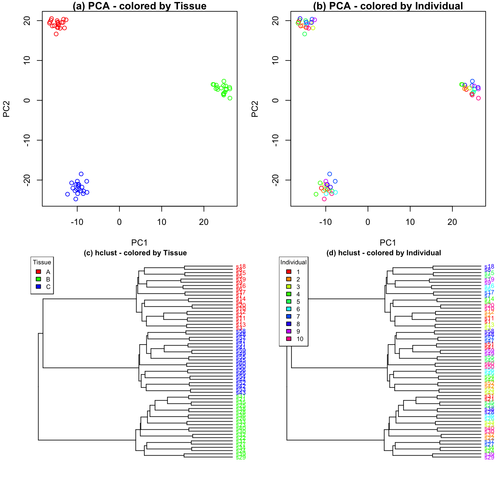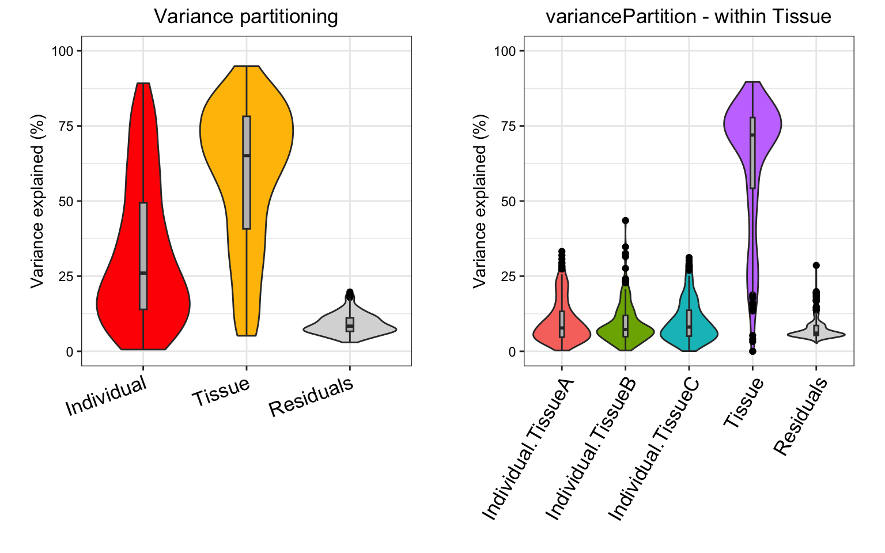

#### Individual is major source of variation

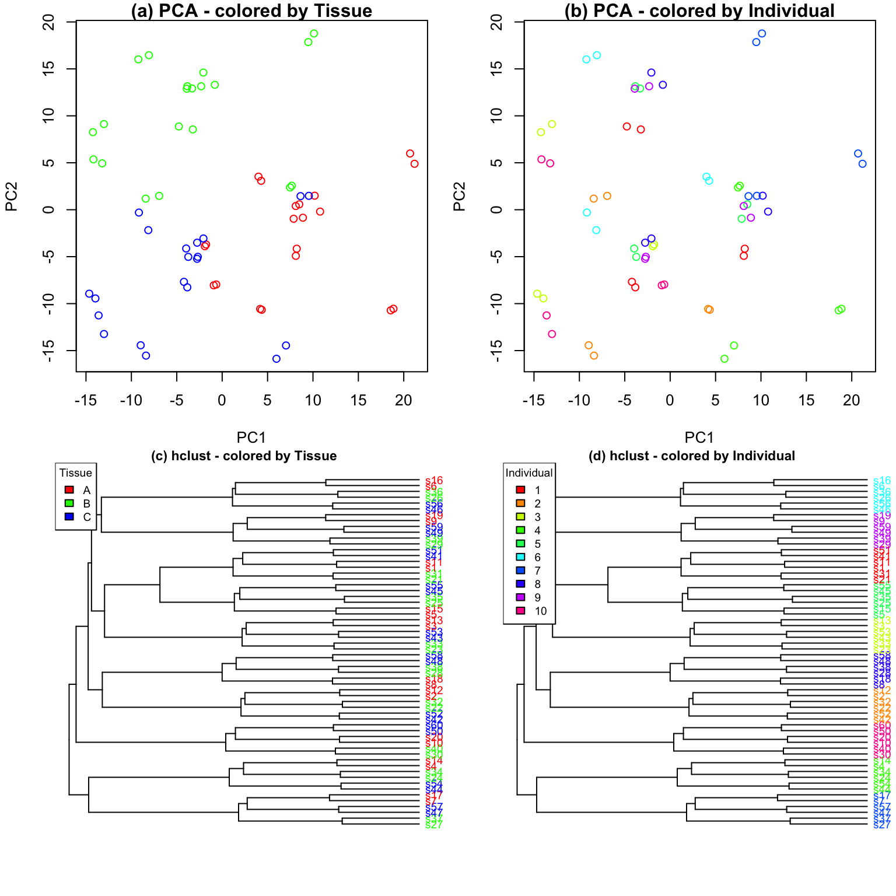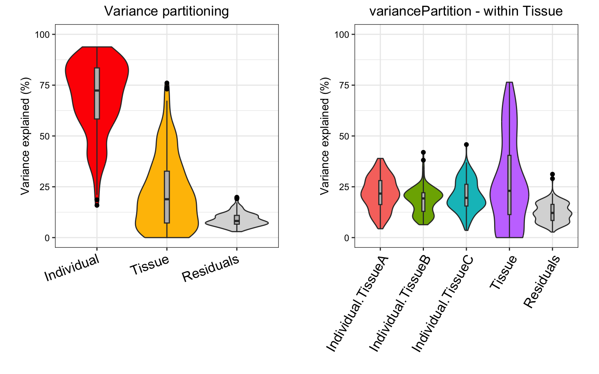

### Statistical details

A `variancePartition` analysis evaluates the linear (mixed) model
\begin{eqnarray} y &=& \sum_j X_j\beta_j + \sum_k Z_k \alpha_k +
\varepsilon \\ \alpha_k &\sim& \mathcal{N}(0, \sigma^2\_{\alpha_k})\\
\varepsilon &\sim& \mathcal{N}(0, \sigma^2\_\varepsilon) \end{eqnarray}
where y is the expression of a single gene across all samples, X_j is
the matrix of j^{th} fixed effect with coefficients \beta_j, Z_k is the
matrix corresponding to the k^{th} random effect with coefficients
\alpha_k drawn from a normal distribution with variance
\sigma^2\_{\alpha_k}. The noise term, \varepsilon, is drawn from a
normal distribution with variance \sigma^2\_\varepsilon. Parameters are
estimated with maximum likelihood, rather than REML, so that fixed
effect coefficients, \beta_j, are explicitly estimated.

I use the term “linear (mixed) model” here since `variancePartition`
works seamlessly when a fixed effects model (i.e. linear model) is
specified.

Variance terms for the fixed effects are computed using the *post hoc*
calculation  
\begin{eqnarray} \hat{\sigma}^2\_{\beta_j} = \text{var}\left( X_j
\hat{\beta}\_j\right). \end{eqnarray} For a fixed effects model, this
corresponds to the sum of squares for each component of the model.

For a standard application of the linear mixed model, where the effect
of each variable is additive, the fraction of variance explained by the
j^{th} fixed effect is \begin{eqnarray}
\frac{\hat{\sigma}^2\_{\beta_j}}{\sum_j \hat{\sigma}^2\_{\beta_j} +
\sum_k \hat{\sigma}^2\_{\alpha_k} + \hat{\sigma}^2\_\varepsilon},
\end{eqnarray} by the k^{th} random effect is \begin{eqnarray}
\frac{\hat{\sigma}^2\_{\alpha_k}}{\sum_j \hat{\sigma}^2\_{\beta_j} +
\sum_k \hat{\sigma}^2\_{\alpha_k} + \hat{\sigma}^2\_\varepsilon},
\end{eqnarray} and the residual variance is \begin{eqnarray}
\frac{\hat{\sigma}^2\_{\varepsilon}}{\sum_j \hat{\sigma}^2\_{\beta_j} +
\sum_k \hat{\sigma}^2\_{\alpha_k} + \hat{\sigma}^2\_\varepsilon}.
\end{eqnarray}

#### Implementation in R

An R formula is used to define the terms in the fixed and random
effects, and
[`fitVarPartModel()`](http://DiseaseNeurogenomics.github.io/variancePartition/reference/fitVarPartModel-method.md)
fits the specified model for each gene separately. If random effects are
specified, [`lme4::lmer()`](https://rdrr.io/pkg/lme4/man/lmer.html) is
used behind the scenes to fit the model, while
[`lm()`](https://rdrr.io/r/stats/lm.html) is used if there are only
fixed effects.
[`fitVarPartModel()`](http://DiseaseNeurogenomics.github.io/variancePartition/reference/fitVarPartModel-method.md)
returns a list of the model fits, and returns the variance partition
statistics for each model in the list.
[`fitExtractVarPartModel()`](http://DiseaseNeurogenomics.github.io/variancePartition/reference/fitExtractVarPartModel-method.md)
combines the actions of
[`fitVarPartModel()`](http://DiseaseNeurogenomics.github.io/variancePartition/reference/fitVarPartModel-method.md)
and into one function call.
[`calcVarPart()`](http://DiseaseNeurogenomics.github.io/variancePartition/reference/calcVarPart-method.md)
is called behind the scenes to compute variance fractions for both fixed
and mixed effects models, but the user can also call this function
directly on a model fit with [`lm()`](https://rdrr.io/r/stats/lm.html)
or [`lmer()`](https://rdrr.io/pkg/lme4/man/lmer.html).

#### Interpretation of percent variance explained

The percent variance explained can be interpreted as the intra-class
correlation (ICC) when a special case of Equation 1 is used. Consider
the simplest example of the i^{th} sample from the k^{th} individual
\begin{eqnarray} y\_{i,k} = \mu + Z \alpha\_{i,k} + e\_{i,k}
\end{eqnarray} with only an intercept term, one random effect
corresponding to individual, and an error term. In this case ICC
corresponds to the correlation between two samples from the same
individual. This value is equal to the fraction of variance explained by
individual. For example, consider the correlation between samples from
the same individual: \begin{eqnarray} ICC &=& cor( y\_{1,k}, y\_{2,k})
\\ &=& cor( \mu + Z \alpha\_{1,k} + e\_{1,k}, \mu + Z \alpha\_{2,k} +
e\_{2,k}) \\ &=& \frac{cov( \mu + Z \alpha\_{1,k} + e\_{1,k}, \mu + Z
\alpha\_{2,k} + e\_{2,k})}{ \sqrt{ var(\mu + Z \alpha\_{1,k} + e\_{1,k})
var( \mu + Z \alpha\_{2,k} + e\_{2,k})}}\\ &=& \frac{cov(Z
\alpha\_{1,k}, Z \alpha\_{2,k})}{\sigma^2\_\alpha +
\sigma^2\_\varepsilon} \\ &=& \frac{\sigma^2\_\alpha}{\sigma^2\_\alpha +
\sigma^2\_\varepsilon} \end{eqnarray} The correlation between samples
from different individuals is: \begin{eqnarray} &=& cor( y\_{1,1},
y\_{1,2}) \\ &=& cor( \mu + Z \alpha\_{1,1} + e\_{1,1}, \mu + Z
\alpha\_{1,2} + e\_{1,2}) \\ &=& \frac{cov(Z \alpha\_{1,1}, Z
\alpha\_{1,2})}{\sigma^2\_\alpha + \sigma^2\_\varepsilon} \\ &=&
\frac{0}{\sigma^2\_\alpha + \sigma^2\_\varepsilon} \\ &=& 0
\end{eqnarray} This interpretation in terms of fraction of variation
explained (FVE) naturally generalizes to multiple variance components.
Consider two sources of variation, individual and cell type with
variances \sigma^2\_{id} and \sigma^2\_{cell}, respectively. Applying a
generalization of the the previous derivation, two samples are
correlated according to:

| Individual | cell type | variance | Interpretation | Correlation value |
|----|----|----|----|----|
| same | different | \frac{\sigma^2\_{id}}{\sigma^2\_{id} + \sigma^2\_{cell} + \sigma^2\_\varepsilon } | FVE by individual | ICC\_{individual} |
| different | same | \frac{\sigma^2\_{cell}}{\sigma^2\_{id} + \sigma^2\_{cell} + \sigma^2\_\varepsilon } | FVE by cell type | ICC\_{cell} |
| same | same | \frac{\sigma^2\_{id} + \sigma^2\_{cell}}{\sigma^2\_{id} + \sigma^2\_{cell} + \sigma^2\_\varepsilon } | sum of FVE by individual & cell type | ICC\_{individual,cell} |
| different | different | \frac{0}{\sigma^2\_{id} + \sigma^2\_{cell} + \sigma^2\_\varepsilon } | sample are independent |  |

Notice that the correlation between samples from the same individual and
same cell type corresponds to the sum of the fraction explained by
individual + fraction explained by cell type. This defines ICC for
individual and tissue, as well as the combined ICC and relates these
values to FVE.

In order to illustrate how this FVE and ICC relate to the correlation
between samples in multilevel datasets, consider a simple example of 5
samples from 2 individuals and 2 tissues:

| Sample | Individual | Cell type |
|--------|------------|-----------|
| a      | 1          | T-Cell    |
| b      | 1          | T-Cell    |
| c      | 1          | monocyte  |
| d      | 2          | T-Cell    |
| e      | 2          | monocyte  |

Modeling the separate effects of individual and tissue gives the
following covariance structure between samples when a linear mixed model
is used:

\begin{array}{ccc} & \\ cov(y)=\begin{array}{ccccc} a \\ b \\ c\\ d\\
e\end{array} & \left( \begin{array}{ccccc} \sigma^2\_{id} +
\sigma^2\_{cell} + \sigma^2\_\varepsilon & & &&\\ \sigma^2\_{id} +
\sigma^2\_{cell} & \sigma^2\_{id} + \sigma^2\_{cell} +
\sigma^2\_\varepsilon & & &\\ \sigma^2\_{id} & \sigma^2\_{id}
&\sigma^2\_{id} + \sigma^2\_{cell} + \sigma^2\_\varepsilon & &\\
\sigma^2\_{cell} & \sigma^2\_{cell} &0 &\sigma^2\_{id} +
\sigma^2\_{cell} + \sigma^2\_\varepsilon &\\ 0 & 0 &\sigma^2\_{cell} &
\sigma^2\_{id} &\sigma^2\_{id} + \sigma^2\_{cell} +
\sigma^2\_\varepsilon \\ \end{array} \right)\end{array}

The covariance matrix is symmetric so that blank entries take the value
on the opposite side of the diagonal. The covariance can be converted to
correlation by dividing by \sigma^2\_{id} + \sigma^2\_{cell} +
\sigma^2\_\varepsilon, and this gives the results from above. This
example generalizes to any number of variance components (Pinheiro and
Bates 2000).

#### Variation with multiple subsets of the data

The linear mixed model underlying `variancePartition` allows the effect
of one variable to depend on the value of another variable.
Statistically, this is called a varying coefficient model (Pinheiro and
Bates 2000; Galecki and Burzykowski 2013). This model arises in
`variancePartition` analysis when the variation explained by individual
depends on tissue or cell type.

A given sample is only from one cell type, so this analysis asks a
question about a subset of the data. The the data is implicitly divided
into subsets base on cell type and variation explained by individual is
evaluated within each subset. The data is not actually divided onto
subset, but the statistical model essentially examples samples with each
cell type. This subsetting means that the variance fractions do not sum
to 1.

Consider a concrete example with variation from across individual and
cell types (T-cells and monocytes) with data from the i^{th} sample from
the k^{th} individual, sex of s and cell type c. Modeling the variation
across individuals within cell type corresponds to \begin{eqnarray}
y\_{i,k,s,c} = \mu + Z^{(sex)} \alpha\_{i,s} + Z^{(Tcell\| id)}
\alpha\_{i,k,c} + Z^{(monocyte\| id)} \alpha\_{i,k,c} + e\_{i,k,s,c}
\end{eqnarray}

with corresponding variance components:

| Variance component | Interpretation |
|----|----|
| \sigma^2\_{sex} | variance across sex (which is the same for all cell types) |
| \sigma^2\_{(Tcell\| id)} | variance across individuals within T-cells |
| \sigma^2\_{(monocyte\| id)} | variance across individuals within monocytes |
| \sigma^2\_\varepsilon | residual variance |

Since the dataset is now divided into multiple subsets, direct
interpretation of the fraction of variation explained (FVE) as
intra-class correlation does not apply. Instead, we compute a
“pseudo-FVE” by approximating the total variance attributable to cell
type by using a weighted average of the within cell type variances
weighted by the sample size within each cell type. Thus the values of
pseudo-FVE do not have the simple interpretation as in the standard
application of `variancePartition`, but allows ranking of variables
based on genome-wide contribution to variance and analysis of gene-level
results.

### Variance partitioning and differential expression

Differential expression (DE) is widely used to identify gene which show
difference is expression between two subsets of the data (i.e. case
versus controls). For a single gene, DE analysis measures the difference
in mean expression between the two subsets. (Since expression is usually
analyzed on a log scale, DE results are usually shown in terms of log
fold changes between the two subsets ). In the Figure, consider two
simulated examples of a gene whose expression differs between males and
females. The mean expression in males is 0 and the mean expression in
females is 2 in both cases. Therefore, the fold change is 2 in both
cases.

However, the fraction of expression variation explained by sex is very
different in these two examples. In example A, there is very little
variation *within* each sex, so that variation *between* sexes is very
high at 91.1%. Conversely, example B shows high variation *within*
sexes, so that variation *between* sexes is only 17.8%.

The fact that the fold change or the fraction of variation is
significantly different from 0 indicates differential expression between
the two sexes. Yet these two statistics have different interpretations.
The fold change from DE analysis tests a difference in means between two
sexes. The fraction of variation explained compares the variation
explained by sex to the total variation.

Thus the fraction of variation explained reported by `variancePartition`
reflects as different aspect of the data not captured by DE analysis.

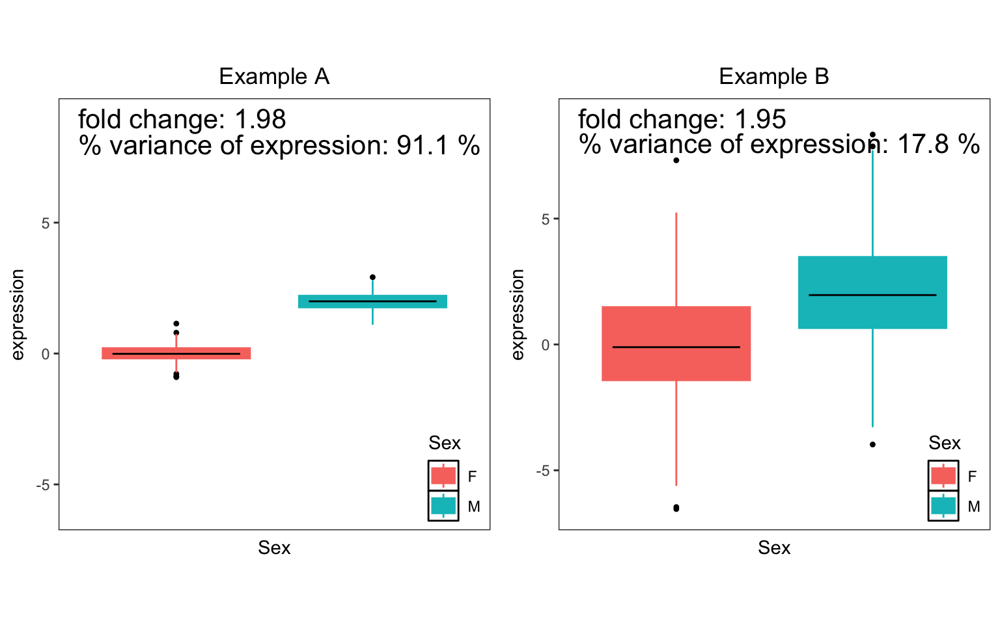

#### Modelling error in gene expression measurements

Uncertainty in the measurement of gene expression can be modeled with
precision weights and tests of differentially expression using
[`limma::voom()`](https://rdrr.io/pkg/limma/man/voom.html) model this
uncertainty directly with a heteroskedastic linear regression (Law et
al. 2014). `variancePartition` can use these precision weights in a
heteroskedastic linear mixed model implemented in `lme4` (Bates et al.
2015). These precision weights are used seamlessly by calling
[`fitVarPartModel()`](http://DiseaseNeurogenomics.github.io/variancePartition/reference/fitVarPartModel-method.md)
or
[`fitExtractVarPartModel()`](http://DiseaseNeurogenomics.github.io/variancePartition/reference/fitExtractVarPartModel-method.md)
on the output of
[`limma::voom()`](https://rdrr.io/pkg/limma/man/voom.html). Otherwise
the user can specify the weights with the `weightsMatrix` parameter.

## Session Info

    ## R version 4.5.1 (2025-06-13)
    ## Platform: aarch64-apple-darwin23.6.0
    ## Running under: macOS Sonoma 14.7.1
    ## 
    ## Matrix products: default
    ## BLAS/LAPACK: /opt/homebrew/Cellar/openblas/0.3.30/lib/libopenblasp-r0.3.30.dylib;  LAPACK version 3.12.0
    ## 
    ## locale:
    ## [1] en_US.UTF-8/en_US.UTF-8/en_US.UTF-8/C/en_US.UTF-8/en_US.UTF-8
    ## 
    ## time zone: America/New_York
    ## tzcode source: internal
    ## 
    ## attached base packages:
    ## [1] stats4    stats     graphics  grDevices utils     datasets  methods   base     
    ## 
    ## other attached packages:
    ##  [1] dendextend_1.19.1           ballgown_2.40.0             DESeq2_1.48.2              
    ##  [4] SummarizedExperiment_1.38.1 Biobase_2.68.0              MatrixGenerics_1.20.0      
    ##  [7] matrixStats_1.5.0           GenomicRanges_1.60.0        GenomeInfoDb_1.44.3        
    ## [10] IRanges_2.42.0              S4Vectors_0.48.0            BiocGenerics_0.54.1        
    ## [13] generics_0.1.4              edgeR_4.6.3                 lme4_1.1-38                
    ## [16] Matrix_1.7-4                variancePartition_1.39.5    BiocParallel_1.42.2        
    ## [19] limma_3.64.3                ggplot2_4.0.1              
    ## 
    ## loaded via a namespace (and not attached):
    ##   [1] RColorBrewer_1.1-3       jsonlite_2.0.0           magrittr_2.0.4          
    ##   [4] farver_2.1.2             nloptr_2.2.1             rmarkdown_2.30          
    ##   [7] fs_1.6.6                 BiocIO_1.18.0            ragg_1.5.0              
    ##  [10] vctrs_0.6.5              memoise_2.0.1            minqa_1.2.8             
    ##  [13] Rsamtools_2.24.1         RCurl_1.98-1.17          htmltools_0.5.8.1       
    ##  [16] S4Arrays_1.8.1           curl_7.0.0               broom_1.0.10            
    ##  [19] SparseArray_1.8.1        sass_0.4.10              KernSmooth_2.23-26      
    ##  [22] bslib_0.9.0              htmlwidgets_1.6.4        desc_1.4.3              
    ##  [25] pbkrtest_0.5.5           plyr_1.8.9               cachem_1.1.0            
    ##  [28] GenomicAlignments_1.44.0 lifecycle_1.0.4          iterators_1.0.14        
    ##  [31] pkgconfig_2.0.3          R6_2.6.1                 fastmap_1.2.0           
    ##  [34] GenomeInfoDbData_1.2.14  rbibutils_2.4            digest_0.6.39           
    ##  [37] numDeriv_2016.8-1.1      AnnotationDbi_1.70.0     textshaping_1.0.4       
    ##  [40] RSQLite_2.4.4            labeling_0.4.3           mgcv_1.9-4              
    ##  [43] httr_1.4.7               abind_1.4-8              compiler_4.5.1          
    ##  [46] bit64_4.6.0-1            aod_1.3.3                withr_3.0.2             
    ##  [49] S7_0.2.1                 backports_1.5.0          viridis_0.6.5           
    ##  [52] DBI_1.2.3                gplots_3.2.0             MASS_7.3-65             
    ##  [55] DelayedArray_0.34.1      rjson_0.2.23             corpcor_1.6.10          
    ##  [58] gtools_3.9.5             caTools_1.18.3           tools_4.5.1             
    ##  [61] remaCor_0.0.20           glue_1.8.0               restfulr_0.0.16         
    ##  [64] nlme_3.1-168             grid_4.5.1               reshape2_1.4.5          
    ##  [67] sva_3.56.0               gtable_0.3.6             tidyr_1.3.1             
    ##  [70] XVector_0.48.0           pillar_1.11.1            stringr_1.6.0           
    ##  [73] genefilter_1.90.0        splines_4.5.1            dplyr_1.1.4             
    ##  [76] lattice_0.22-7           survival_3.8-3           rtracklayer_1.68.0      
    ##  [79] bit_4.6.0                annotate_1.86.1          tidyselect_1.2.1        
    ##  [82] locfit_1.5-9.12          Biostrings_2.76.0        knitr_1.50              
    ##  [85] gridExtra_2.3            reformulas_0.4.2         RhpcBLASctl_0.23-42     
    ##  [88] xfun_0.54                statmod_1.5.1            stringi_1.8.7           
    ##  [91] UCSC.utils_1.4.0         yaml_2.3.10              boot_1.3-32             
    ##  [94] evaluate_1.0.5           codetools_0.2-20         tibble_3.3.0            
    ##  [97] cli_3.6.5                xtable_1.8-4             systemfonts_1.3.1       
    ## [100] Rdpack_2.6.4             jquerylib_0.1.4          dichromat_2.0-0.1       
    ## [103] Rcpp_1.1.0               EnvStats_3.1.0           png_0.1-8               
    ## [106] XML_3.99-0.20            parallel_4.5.1           pkgdown_2.2.0           
    ## [109] blob_1.2.4               bitops_1.0-9             viridisLite_0.4.2       
    ## [112] mvtnorm_1.3-3            lmerTest_3.1-3           scales_1.4.0            
    ## [115] purrr_1.2.0              crayon_1.5.3             fANCOVA_0.6-1           
    ## [118] rlang_1.1.6              cowplot_1.2.0            KEGGREST_1.48.1

## References

Anders, Simon, Paul Theodor Pyl, and Wolfgang Huber. 2015. “HTSeq-A
Python framework to work with high-throughput sequencing data.”
*Bioinformatics* 31 (2): 166–69.
<https://doi.org/10.1093/bioinformatics/btu638>.

Bates, D., M. Machler, B. Bolker, and S. Walker. 2015. “Fitting Linear
Mixed-Effects Models Using lme4.” *Journal of Statistical Software* 67
(1). <https://doi.org/10.18637/jss.v067.i01>.

Bray, Nicolas L, Harold Pimentel, Páll Melsted, and Lior Pachter. 2016.
“Near-optimal probabilistic RNA-seq quantification.” *Nature
Biotechnology* 34: 525–27. <https://doi.org/10.1038/nbt.3519>.

Carvalho, Benilton S, and Rafael A Irizarry. 2010. “A Framework for
Oligonucleotide Microarray Preprocessing.” *Bioinformatics* (Oxford, UK)
26 (19): 2363–67. <https://doi.org/10.1093/bioinformatics/btq431>.

Frazee, Alyssa C, Geo Pertea, Andrew E Jaffe, Ben Langmead, Steven L
Salzberg, and Jeffrey T Leek. 2015. “Ballgown bridges the gap between
transcriptome assembly and expression analysis.” *Nature Biotechnology*
33 (3): 243–46. <https://doi.org/10.1038/nbt.3172>.

Galecki, A., and T. Burzykowski. 2013. *Linear Mixed Effects Modeling
using R.* Springer.

Law, C. W., Y. Chen, W. Shi, and G. K. Smyth. 2014. “Voom: precision
weights unlock linear model analysis tools for RNA-seq read counts.”
*Genome Biology* 15 (2): R29.
<https://doi.org/10.1186/gb-2014-15-2-r29>.

Li, Bo, and Colin N Dewey. 2011. “RSEM: accurate transcript
quantification from RNA-Seq data with or without a reference genome.”
*BMC Bioinformatics* 12 (1): 323.
<https://doi.org/10.1186/1471-2105-12-323>.

Liao, Yang, Gordon K. Smyth, and Wei Shi. 2014. “FeatureCounts: An
efficient general purpose program for assigning sequence reads to
genomic features.” *Bioinformatics* 30 (7): 923–30.
<https://doi.org/10.1093/bioinformatics/btt656>.

Love, Michael I., Wolfgang Huber, and Simon Anders. 2014. “Moderated
estimation of fold change and dispersion for RNA-seq data with DESeq2.”
*Genome Biology* 15 (12): 550.
<https://doi.org/10.1186/s13059-014-0550-8>.

Patro, Rob, Geet Duggal, and Carl Kingsford. 2015. “Accurate, fast, and
model-aware transcript expression quantification with Salmon.”
*Bioarxiv*, ahead of print. <https://doi.org/10.1101/021592>.

Patro, Rob, Stephen M Mount, and Carl Kingsford. 2014. “Sailfish enables
alignment-free isoform quantification from RNA-seq reads using
lightweight algorithms.” *Nature Biotechnology* 32 (5): 462–64.
<https://doi.org/10.1038/nbt.2862>.

Pinheiro, J. C., and D. M. Bates. 2000. *[Mixed-Effects Models in S and
S-Plus](https://www.ncbi.nlm.nih.gov/pubmed/40509311)*. Springer.

Robinson, M. D., and A. Oshlack. 2010. “A scaling normalization method
for differential expression analysis of RNA-seq data.” *Genome Biology*
11 (3): R25. <https://doi.org/10.1186/gb-2010-11-3-r25>.

Soneson, Charlotte, Michael I. Love, and Mark D. Robinson. 2015.
“Differential analyses for RNA-seq: transcript-level estimates improve
gene-level inferences.” *F1000Research* 4 (0): 1521.
<https://doi.org/10.12688/f1000research.7563.2>.

Trapnell, Cole, Brian a Williams, Geo Pertea, et al. 2010. “Transcript
assembly and quantification by RNA-Seq reveals unannotated transcripts
and isoform switching during cell differentiation.” *Nature
Biotechnology* 28 (5): 511–15. <https://doi.org/10.1038/nbt.1621>.
